# LearningOS Platform - Architecture Diagram

## Table of Contents

1. [High-Level System Architecture](#1-high-level-system-architecture)
2. [CDK Stack Relationships](#2-cdk-stack-relationships)
3. [Authentication & Authorization Flow](#3-authentication--authorization-flow)
4. [Learning Data Flow](#4-learning-data-flow)
5. [DPI Integration Flow](#5-dpi-integration-flow)
6. [AI/ML Pipeline](#6-aiml-pipeline)
7. [Multi-Tenant Isolation](#7-multi-tenant-isolation)
8. [Network Topology](#8-network-topology)
9. [Messaging Architecture](#9-messaging-architecture)
10. [Storage Architecture](#10-storage-architecture)
11. [CDN & Content Delivery](#11-cdn--content-delivery)
12. [Component Inventory](#12-component-inventory)

---

## 1. High-Level System Architecture

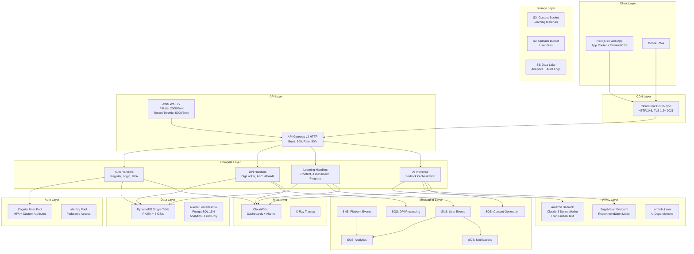

---

## 2. CDK Stack Relationships

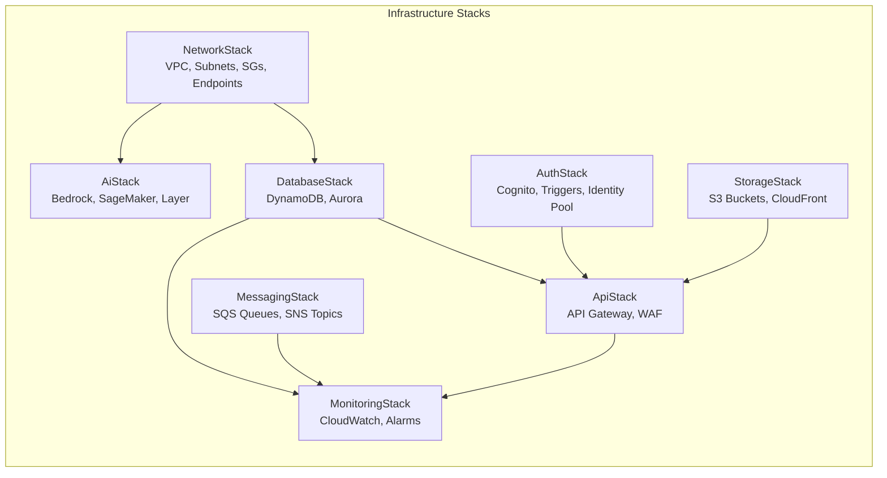

Each stack is parameterized by `stage` (dev/staging/prod) with environment-specific configurations:

| Stack | Dev | Staging | Prod |
|-------|-----|---------|------|
| NetworkStack | 2 AZs, 1 NAT | 2 AZs, 1 NAT | 3 AZs, 2 NATs, VPC Endpoints |
| DatabaseStack | PAY_PER_REQUEST | PAY_PER_REQUEST | PROVISIONED + Auto-scaling |
| AuthStack | MFA Optional | MFA Optional | MFA Required |
| StorageStack | Auto-delete objects | Auto-delete objects | RETAIN policy |
| ApiStack | Relaxed CORS | Relaxed CORS | Strict *.platform.gov.in |
| AiStack | Bedrock only | Bedrock only | Bedrock + SageMaker endpoint |
| MonitoringStack | 1-week log retention | 1-month retention | 1-year+ retention |

---

## 3. Authentication & Authorization Flow

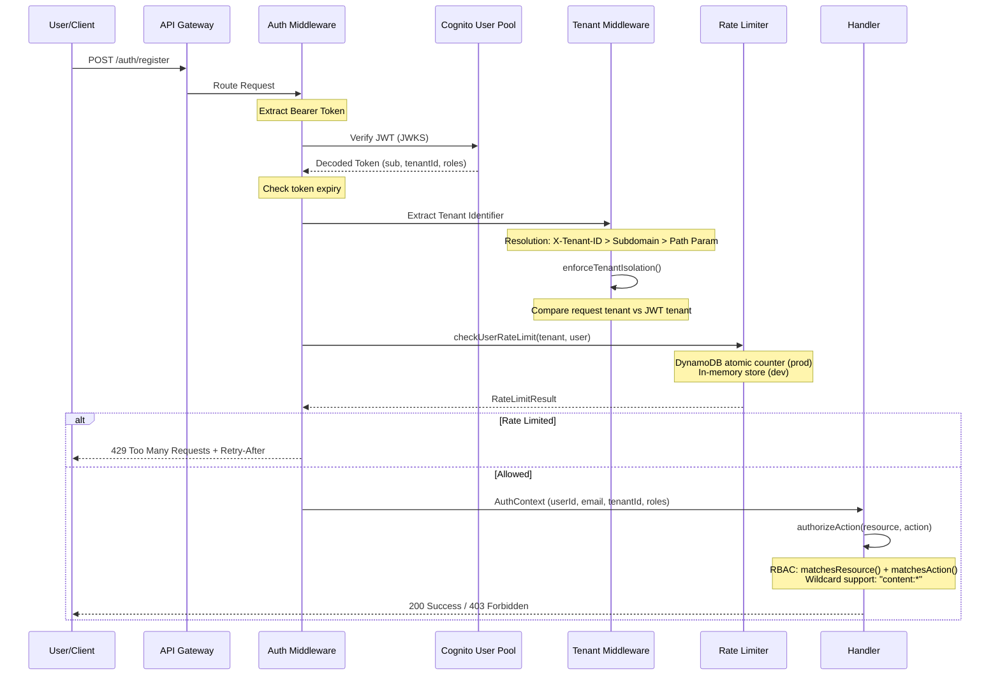

### Cognito Lambda Triggers

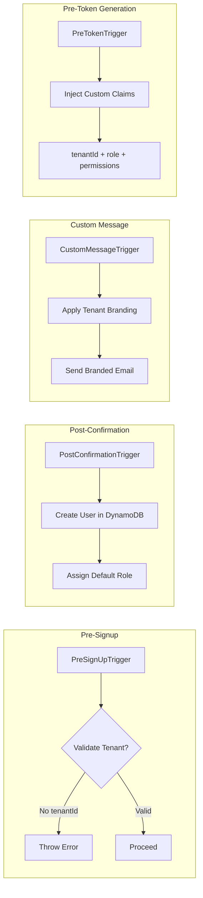

---

## 4. Learning Data Flow

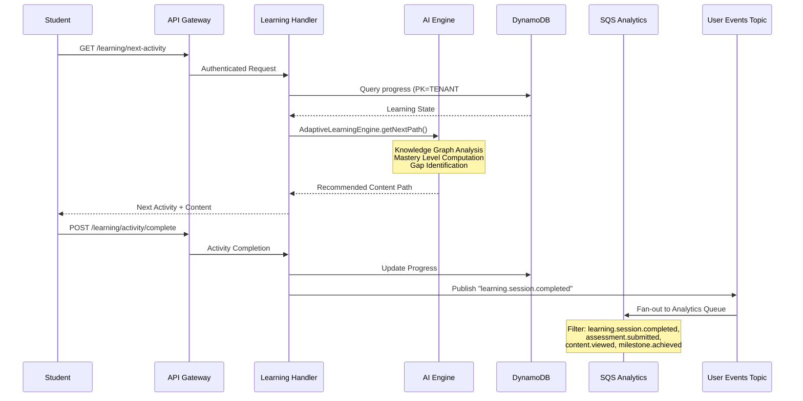

---

## 5. DPI Integration Flow

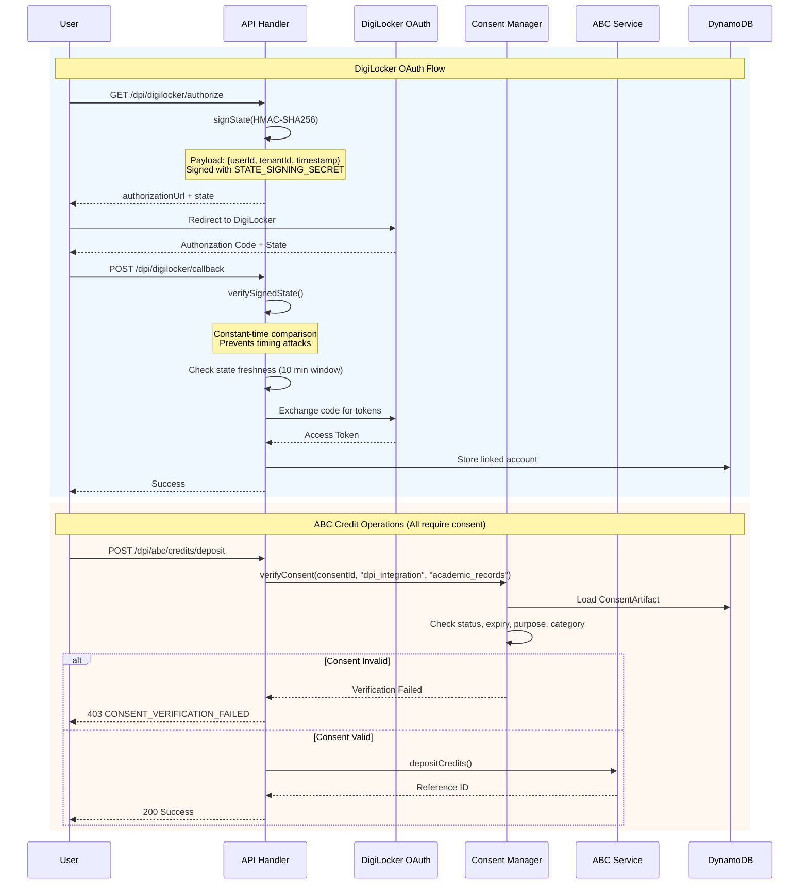

---

## 6. AI/ML Pipeline

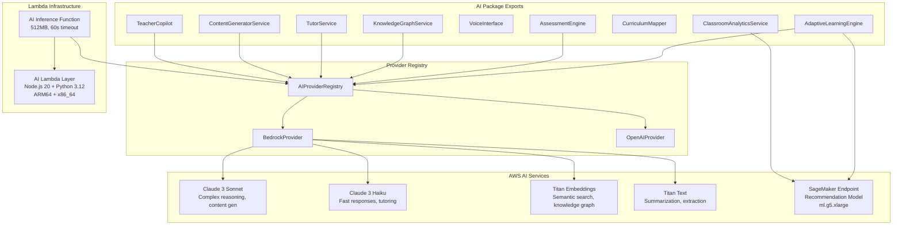

### AI Inference Request Flow

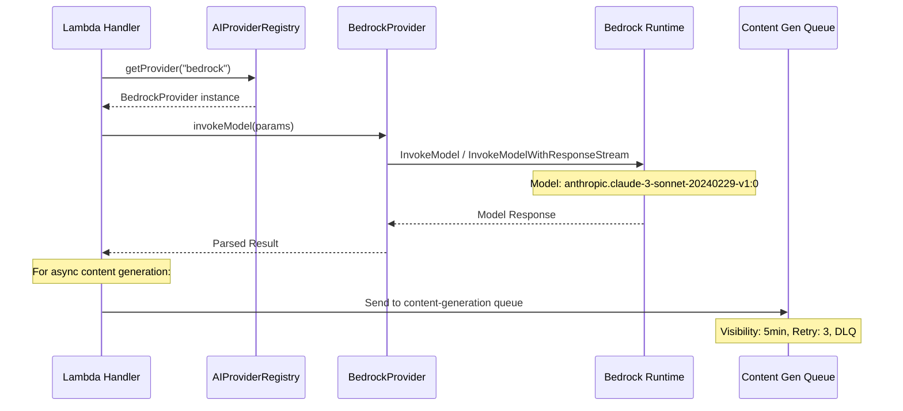

---

## 7. Multi-Tenant Isolation

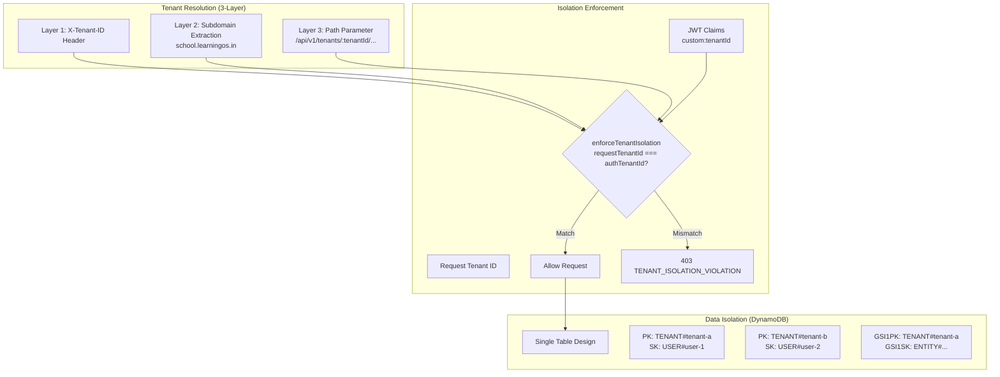

---

## 8. Network Topology

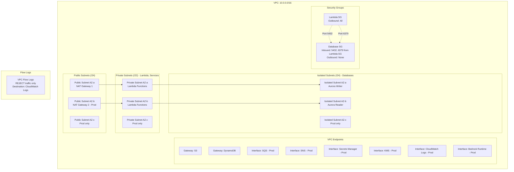

---

## 9. Messaging Architecture

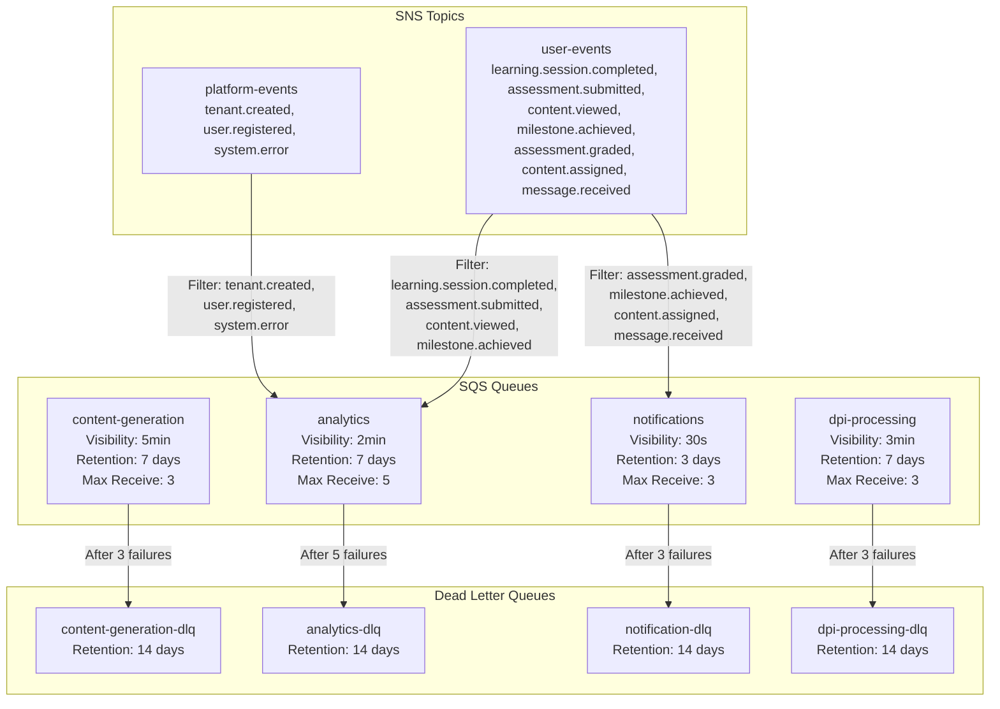

All queues use SQS managed encryption (SSE-SQS).

---

## 10. Storage Architecture

```mermaid
graph TB
    subgraph "S3 Buckets"
        subgraph "Content Bucket"
            CB[learning-os-{stage}-content-{accountId}]
            CB_V[Versioned: Yes]
            CB_E[Encryption: S3-Managed]
            CB_BP[Block Public Access: ALL]
            CB_LC1[archives/ -> IA @ 90d -> Glacier @ 365d]
            CB_LC2[Abort incomplete multipart: 7d]
            CB_IT[Intelligent Tiering: Archive 90d, Deep 180d]
        end

        subgraph "Uploads Bucket"
            UB[learning-os-{stage}-uploads-{accountId}]
            UB_V[Versioned: No]
            UB_E[Encryption: S3-Managed]
            UB_BP[Block Public Access: ALL]
            UB_LC1[temp/ -> Expire @ 7d]
            UB_LC2[processed/ -> IA @ 30d]
        end

        subgraph "Data Lake Bucket"
            DLB[learning-os-{stage}-datalake-{accountId}]
            DLB_V[Versioned: Yes]
            DLB_E[Encryption: S3-Managed]
            DLB_BP[Block Public Access: ALL]
            DLB_LC1[raw/ -> IA @ 30d -> Glacier @ 90d]
            DLB_LC2["audit/ -> Glacier @ 365d -> Expire @ 2555d (7 years)"]
        end
    end

    subgraph "DynamoDB Single-Table Design"
        DDB[Table: learning-os-{stage}]
        PK[PK: Partition Key - String]
        SK[SK: Sort Key - String]
        TTL[TTL Attribute for auto-expiry]
        STREAM[Stream: NEW_AND_OLD_IMAGES]
        ENC[Encryption: AWS Managed]
        PITR[Point-in-Time Recovery: Enabled]

        subgraph "Global Secondary Indexes"
            GSI1[GSI1: Tenant-scoped queries<br/>GSI1PK / GSI1SK - ALL projection]
            GSI2[GSI2: Entity-type cross-tenant<br/>GSI2PK / GSI2SK - ALL projection]
            GSI3[GSI3: Inverted index (SK->PK)<br/>Relationship queries - ALL projection]
            GSI4[GSI4: Status-based queries<br/>GSI4PK / GSI4SK - KEYS_ONLY projection]
            GSI5[GSI5: Date-based queries<br/>GSI5PK / GSI5SK - ALL projection]
        end
    end

    subgraph "Aurora Serverless v2 (Prod Only)"
        AUR[PostgreSQL 15.4]
        AUR_W[Writer Instance]
        AUR_R[Reader Instance (scale with writer)]
        AUR_CAP[Capacity: 0.5 - 8 ACU]
        AUR_ENC[Storage Encrypted: Yes]
        AUR_BK[Backup: 14 days retention]
        AUR_SUB[Subnet: PRIVATE_ISOLATED]
    end
```

### DynamoDB Access Patterns

| Access Pattern | PK | SK | Index |
|---|---|---|---|
| Get user by ID | TENANT#{tenantId} | USER#{userId} | Table |
| All users in tenant | TENANT#{tenantId} | USER# | GSI1 |
| Entity type queries | TYPE#{entityType} | CREATED#{timestamp} | GSI2 |
| Relationship lookup | (original SK) | (original PK) | GSI3 |
| Pending items | STATUS#pending | CREATED#{timestamp} | GSI4 |
| Audit log by date | AUDIT#{tenantId} | DATE#{timestamp} | GSI5 |

---

## 11. CDN & Content Delivery

```mermaid
graph LR
    subgraph "CloudFront Distribution"
        CF[CloudFront CDN]
        CF_HTTP[HTTP/2 + HTTP/3]
        CF_TLS[TLS 1.2+ (2021 Policy)]
        CF_PRICE[Price Class 200]

        subgraph "Behaviors"
            DEF["Default: /*<br/>Cache: CACHING_OPTIMIZED<br/>Methods: GET, HEAD, OPTIONS<br/>Compress: Yes"]
            MEDIA["/media/*<br/>TTL: 1d min, 30d default, 365d max<br/>Gzip + Brotli<br/>Methods: GET, HEAD, OPTIONS"]
        end
    end

    subgraph "Origin"
        OAI[Origin Access Identity]
        S3[Content S3 Bucket]
    end

    CF --> DEF
    CF --> MEDIA
    DEF --> OAI
    MEDIA --> OAI
    OAI --> S3
```

---

## 12. Component Inventory

### Applications

| Component | Path | Technology | Description |
|---|---|---|---|
| Web Frontend | `apps/web` | Next.js 14, App Router, Tailwind CSS | Student/teacher/admin interface |
| API Backend | `apps/api` | Node.js 20, Lambda, Serverless Framework | RESTful API handlers |

### Packages

| Component | Path | Key Exports | Description |
|---|---|---|---|
| Shared | `packages/shared` | Types, ConsentManager, encryption utils | Shared utilities and DPI integration |
| UI | `packages/ui` | React components | Reusable component library |
| AI | `packages/ai` | AdaptiveLearningEngine, AssessmentEngine, KnowledgeGraphService, TutorService, VoiceInterface, ContentGeneratorService, CurriculumMapper, TeacherCopilot, ClassroomAnalyticsService, AIProviderRegistry, BedrockProvider, OpenAIProvider | AI/ML engine for adaptive learning |

### Infrastructure Stacks

| Stack | Path | Key Resources |
|---|---|---|
| NetworkStack | `infrastructure/lib/network-stack.ts` | VPC, Subnets (3 types), NAT Gateways, Security Groups, VPC Endpoints (8) |
| AuthStack | `infrastructure/lib/auth-stack.ts` | Cognito User Pool, User Pool Client, Identity Pool, 4 Lambda Triggers |
| DatabaseStack | `infrastructure/lib/database-stack.ts` | DynamoDB Table (5 GSIs), Aurora Serverless v2 (prod) |
| StorageStack | `infrastructure/lib/storage-stack.ts` | 3 S3 Buckets, CloudFront Distribution, OAI |
| MessagingStack | `infrastructure/lib/messaging-stack.ts` | 4 SQS Queues, 4 DLQs, 2 SNS Topics |
| ApiStack | `infrastructure/lib/api-stack.ts` | HTTP API Gateway v2, WAF WebACL (5 rules), Access Logs |
| AiStack | `infrastructure/lib/ai-stack.ts` | Bedrock IAM Role, SageMaker Endpoint (prod), Lambda Layer |
| MonitoringStack | `infrastructure/lib/monitoring-stack.ts` | CloudWatch Dashboard, 4 Alarms, 4 Log Groups, Metric Filters |

### API Middleware Stack

| Middleware | File | Purpose |
|---|---|---|
| Authentication | `apps/api/src/middleware/auth.ts` | JWT verification, token extraction, RBAC |
| Tenant Resolution | `apps/api/src/middleware/tenant.ts` | 3-layer tenant identification, isolation enforcement |
| Rate Limiting | `apps/api/src/middleware/rateLimit.ts` | Per-user (req/min) + per-tenant (req/hr) limiting |

### DPI Integration Handlers

| Handler | File | Operations |
|---|---|---|
| DigiLocker | `apps/api/src/handlers/dpi/digilocker.ts` | OAuth authorize, callback, pull documents, verify |
| ABC | `apps/api/src/handlers/dpi/abc.ts` | Get account, deposit/withdraw/transfer credits, transcript |
| Consent Manager | `packages/shared/src/dpi/consent-manager.ts` | Create, batch, withdraw, verify, guardian consent |

### Test Infrastructure

| Component | Path | Description |
|---|---|---|
| E2E Tests | `tests/e2e/` | 6 Playwright spec files |
| Config | `tests/playwright.config.ts` | Playwright configuration |
